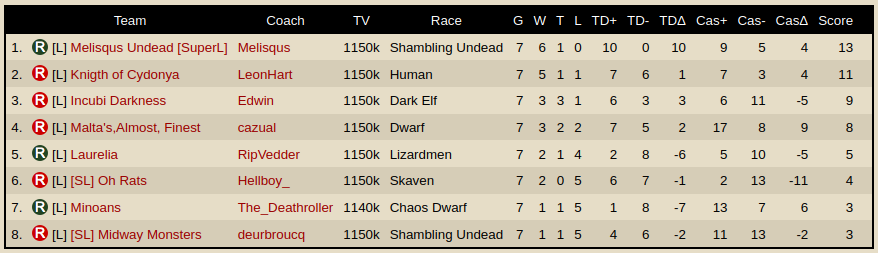

# HOW TO RUN:

Do github clone repo: https://github.com/gsverhoeven/fumbbl_datasets/

Go to folder datasets/v0.6
extract Zip file into datasets/current

```{r setup, include=FALSE}
library(tidyverse)
library(httr)
library(jsonlite)
library(flextable)

knitr::opts_chunk$set(echo = TRUE)
options(dplyr.summarise.inform = FALSE)
```

# Read in data

```{r}
fullrun <- 0

if(fullrun){
  df_matches <- read.csv(file = "../fumbbl_datasets/datasets/current/df_matches.csv") # PM do unzip
  df_matches <- df_matches %>%
    filter(group_id == 15615) %>% # TSL
    filter(tournament_id != 57864) %>%
    filter(tournament_id != 59504)
  
  df_matches$match_date <- as.Date(df_matches$match_date)
  df_matches$week_date <- as.Date(df_matches$week_date)
  saveRDS(df_matches, "data/df_matches_tsl.rds")
} else {
  df_matches <- readRDS("data/df_matches_tsl.rds")
}
```

```{r}
fullrun <- 0

if(fullrun){
  df_mbt <- read.csv(file = "../fumbbl_datasets/datasets/current/df_mbt.csv")
  df_mbt <- df_mbt %>%
    filter(group_id == 15615)  %>% # TSL
    filter(tournament_id != 57864) %>%
    filter(tournament_id != 59504)
  
  df_mbt$match_date <- as.Date(df_mbt$match_date)
  df_mbt$week_date <- as.Date(df_mbt$week_date)
  
  df_mbt[df_mbt$race_name == "Khorne",]$bb2020_nov21_tier <- 2
  df_mbt[df_mbt$race_name == "Khorne",]$bb2020_tier <- 2
  saveRDS(df_mbt, "data/df_mbt_tsl.rds")
} else {
  df_mbt <- readRDS("data/df_mbt_tsl.rds")
}
```

Fix coach name changes

```{r}
df_mbt[df_mbt$coach_name == "Edwin25301",]$coach_name <- "Edwin"
```

# Add seasons, levels

```{r}
cl <- as_tibble(read.csv2("input/spl_seasons_div.csv")) %>% 
  select(-tournament_name)
```

```{r}
df_matches <- df_matches %>%
  left_join(cl, by = "tournament_id")

df_mbt <- df_mbt %>%
  left_join(cl, by = "tournament_id")
```


# Fetch adminned match data from API endpoint

```{r}
fullrun <- 0
all_tourneys <- unique(df_matches$tournament_id)

if(fullrun){
  i <- 0
  for (tournament_id in all_tourneys){
    url <- paste0("https://fumbbl.com/api/tournament/schedule/", tournament_id)
    res <- GET(url)
    if ( i == 0) all_matches <- data.frame(tournament_id, flatten(fromJSON(rawToChar(res$content))))
    else all_matches <- rbind(all_matches, data.frame(tournament_id, flatten(fromJSON(rawToChar(res$content)))))
    i <- i+1
  }
  saveRDS(all_matches, file = "data/all_matches.rds")
} else {
  all_matches <- readRDS("data/all_matches.rds")
}
```


```{r}
all_matches <- all_matches %>% 
  left_join(df_matches %>% 
              select(tournament_id, tournament_name, season, level) %>% distinct(), by = "tournament_id") %>%
  select(-position) %>% 
  filter(tournament_id != 57864) %>%
  filter(tournament_id != 59504)
```

# integrate with df_matches

need a for loop to get rid of all the nested data.frames.

```{r}
colnames(all_matches)
all_matches$home_team_id <- NA
all_matches$away_team_id <- NA
all_matches$home_score <- NA
all_matches$away_score <- NA

for(i in 1:nrow(all_matches)){
  all_matches[i,]$home_team_id <- all_matches$teams[[i]]$id[1]
  all_matches[i,]$away_team_id <- all_matches$teams[[i]]$id[2]
  all_matches[i,]$home_score <- all_matches$result.teams[[i]]$score[1]
  all_matches[i,]$away_score <- all_matches$result.teams[[i]]$score[2]
}

all_matches$teams <- NULL
all_matches$result.teams <- NULL

all_matches <- all_matches %>% rename(match_id = result.id)

all_matches <- all_matches %>%
  rename(team_id = home_team_id) %>%
  rename(team_score = home_score) 
```

next: create all_mbt, i.e. duplicate all matches with home/away reversed.

for now just enrich with data needed to make the leaderboard.

```{r}
all_matches2 <- all_matches %>%
  mutate(home_team_id_tmp = team_id,
         home_score_tmp = team_score) %>%
  mutate(team_id = away_team_id,
         team_score = away_score) %>%
  mutate(away_team_id = home_team_id_tmp,
         away_score = home_score_tmp) %>%
  select(-home_team_id_tmp, -home_score_tmp)

all_mbt <- rbind(all_matches, all_matches2)
rm(all_matches, all_matches2)
```

# Fetch coach names from team_ids

This is necessary because not all coaches actually played matches.
There are also coaches that did not play ANY matches, so we do not have their coach name.


```{r}
fullrun <- 0
teams <- unique(all_mbt$team_id)

if(fullrun){
  i <- 0
  for (team_id in teams){
    url <- paste0("https://fumbbl.com/api/team/get/", team_id)
    res <- GET(url)
    if ( i == 0) all_teams <- data.frame(team_id, flatten(as.data.frame(fromJSON(rawToChar(res$content))$coach)))
    else all_teams <- rbind(all_teams, data.frame(team_id, flatten(as.data.frame(fromJSON(rawToChar(res$content))$coach))))
    i <- i+1
  }
  saveRDS(all_teams, file = "data/all_teams.rds")
} else {
  all_teams <- readRDS("data/all_teams.rds")
}
```


add match stats (cas etc) to all_mbt:

```{r}
all_mbt <- all_mbt %>%
  left_join(df_mbt %>% select(tournament_id, match_id, team_id,home_comp, home_pass, home_rush, home_block, home_foul, home_cas, away_cas), by = c("tournament_id", "match_id", "team_id"))
  
```

fill in missing coach_ids and coachnames:

```{r}
all_mbt <- all_mbt %>% 
  #select(-coach_id, -coach_name) %>%
  left_join(all_teams, by = c("team_id"))
```


```{r}
# derive wins column
all_mbt <- all_mbt %>%
  mutate(wins = 1) %>%
  mutate(wins = ifelse(team_score == away_score, 0.5, wins)) %>%
  mutate(wins = ifelse(team_score < away_score, 0, wins)) %>%
  mutate(wins = ifelse(match_id == 0 & result.winner == team_id, 1, wins)) %>%
  mutate(wins = ifelse(match_id == 0 & result.winner != team_id, 0, wins))

all_mbt <- all_mbt %>%
  rename(coach_name = name)
```


# Check data: recreate leaderboards
https://fumbbl.com/p/group?op=view&at=1&group=15615&p=tournaments&show=58588

```{r}
main_board <- all_mbt %>% 
  arrange(round) %>%
  group_by(tournament_id, tournament_name, coach_name) %>%
  summarise(G = n(), 
            W = sum(if_else(wins == 1, 1, 0)),
            T = sum(if_else(wins == 0.5, 1, 0)),
            L = sum(if_else(wins == 0, 1, 0)),
            TDfor = sum(team_score),
            TDmin = sum(away_score),
            CASfor = sum(home_cas, na.rm = T),
            CASmin = sum(away_cas, na.rm = T)) %>%
  mutate(TDdelta = TDfor - TDmin,
         CASdelta = CASfor - CASmin,
         tie_breaker = TDdelta + CASdelta,
         score = W*2 + T) 
```


```{r}
writexl::write_xlsx(main_board, "output/main_board.xlsx")
```

eyeball who replaced who.

# read back in: fix replacement coaches

```{r}
main_board <- readxl::read_excel("input/main_board_replacedby.xlsx")

replaced_by <- main_board %>% 
  select(tournament_id, coach_name, replaced_by) %>% 
  drop_na()
```

fix `all_mbt` with dropout replacements:

should fix by replacing also team_id, coach_id

```{r}
all_mbt <- all_mbt %>%
  left_join(replaced_by, by = c("tournament_id", "coach_name")) %>%
    mutate(coach_name = ifelse(!is.na(replaced_by), replaced_by, coach_name)) %>%
  select(-replaced_by)
```

# add race, fix coach and team id


```{r}
all_mbt <- all_mbt %>%
  select(-team_id, -id) %>%
  left_join(df_mbt %>% select(tournament_id, team_id, coach_id, coach_name, race_name) %>% distinct(), by = c("tournament_id", "coach_name"))
```

note to self: 
-team name still missing
-away team_id should also be fixed (or dropped), and result.winner.
-away_race_name missing

# fix NAs for home and away cas in adminned matches

```{r}
all_mbt <- all_mbt %>% 
  mutate(home_cas = ifelse(is.na(home_cas), 0, home_cas),
         away_cas = ifelse(is.na(away_cas), 0, away_cas))
```

# last manual fix

dekra1979 replaced Joemanji but did not play any match, so we do not have a team_id, coach_id and race_name.
Add manually.

```{r}
all_mbt <- all_mbt %>%
  mutate(team_id = ifelse(coach_name == "dekra1979" & tournament_id == 58580, 1101431, team_id),
         coach_id = ifelse(coach_name == "dekra1979" & tournament_id == 58580, 130219, coach_id),
         race_name = ifelse(coach_name == "dekra1979" & tournament_id == 58580, "Skaven", race_name))
```

# add TSL tiers

```{r}
#tsl_tiers <- data.frame(race_name = unique(all_mbt$race_name), tsl_tier = -1)
#writexl::write_xlsx(tsl_tiers, "tsl_tiers.xlsx")

tsl_tiers <- readxl::read_excel("input/tsl_tiers.xlsx")

all_mbt <- all_mbt %>%
  left_join(tsl_tiers, by = "race_name")
```


# final check: compare with leaderboard on fumbbl

```{r}
all_mbt %>% 
  arrange(round) %>%
  filter(tournament_id == 58588) %>%
  group_by(tournament_id, tournament_name, coach_name, race_name) %>%
  summarise(G = n(), 
            W = sum(if_else(wins == 1, 1, 0)),
            T = sum(if_else(wins == 0.5, 1, 0)),
            L = sum(if_else(wins == 0, 1, 0)),
            TDfor = sum(team_score),
            TDmin = sum(away_score),
            CASfor = sum(home_cas),
            CASmin = sum(away_cas)) %>%
  mutate(TDdelta = TDfor - TDmin,
         CASdelta = CASfor - CASmin,
         tie_breaker = TDdelta + CASdelta,
         score = W*2 + T) %>%
  arrange(-score,-tie_breaker) 
```



# Try to work out who are relegated

do in a two step. we add final standings. Then we encode manually and export.

```{r}
main_board <- all_mbt %>% 
  filter(season %in% c(1,2)) %>%
  arrange(round) %>%
  group_by(tournament_id, season, tournament_name, coach_name, race_name) %>%
  summarise(G = n(), 
            W = sum(if_else(wins == 1, 1, 0)),
            T = sum(if_else(wins == 0.5, 1, 0)),
            L = sum(if_else(wins == 0, 1, 0)),
            TDfor = sum(team_score),
            TDmin = sum(away_score),
            CASfor = sum(home_cas),
            CASmin = sum(away_cas)) %>%
  mutate(TDdelta = TDfor - TDmin,
         CASdelta = CASfor - CASmin,
         tie_breaker = TDdelta + CASdelta,
         score = W*2 + T) %>%
  arrange(tournament_id, -score,-tie_breaker) 

main_board$position <- rep(1:8, nrow(main_board)/8) 

#writexl::write_xlsx(main_board %>% select(season, tournament_id, tournament_name, coach_name, position), "promotion_relegation_structure_.xlsx")
promotion_relegation_structure <- readxl::read_excel("input/promotion_relegation_structure.xlsx")

all_mbt <- all_mbt %>%
  left_join(promotion_relegation_structure %>% select(tournament_id, coach_name, action), by = c("tournament_id", "coach_name"))
```

# create seedings and standings 

```{r}
res <- all_mbt %>% filter(season == 2) %>% 
  group_by(coach_name, coach_id, season, level, action) %>% 
  summarise(n = n()) %>% 
  arrange(level)

all_mbt <- all_mbt %>% 
  mutate(next_level = -1,
         next_level = ifelse(action == "relegate", level + 1, next_level),
         next_level = ifelse(action %in% c("remain", "champion"), level, next_level),
         next_level = ifelse(action == "promote", level - 1, next_level))

s1s2 <- all_mbt %>% filter(season != 0) %>% 
  group_by(coach_name, coach_id, season, level) %>% 
  summarise(n = n()) %>% 
  arrange(level)

s3 <- all_mbt %>% filter(season == 2) %>% 
  group_by(coach_name, coach_id, season, next_level) %>% 
  summarise(n = n()) %>% 
  rename(level = next_level) %>%
  mutate(season = 3) %>%
  arrange(level)

coach_levels <- rbind(s1s2, s3)

coach_levels <- coach_levels %>%
  mutate(weight = 7 - level)
```

# add trophy points for winners 

add trophies for tie breaker:

```{r}
coach_levels <- coach_levels %>%
  mutate(trophies = 0) %>%
  mutate(trophies = ifelse(coach_name == "Strider84" & season == 1, 2, trophies),
         trophies = ifelse(coach_name == "Purplegoo" & season == 1, 1, trophies),
         trophies = ifelse(coach_name == "LemonheadWallenstein" & season == 1, 1, trophies),
         trophies = ifelse(coach_name == "Purplegoo" & season == 2, 2, trophies),
         trophies = ifelse(coach_name == "Storr" & season == 2, 1, trophies),
         trophies = ifelse(coach_name == "siggi" & season == 2, 1, trophies)) 
```

# add placement by coach by season for tie breaker

```{r}
coach_levels <- coach_levels %>%
  left_join(main_board %>% ungroup() %>% select(coach_name, season, position) , by = c("coach_name", "season"))
```


# ANALYSIS 

Calculate ranking, first by division weight, second by trophies, and third by placement within divisions.

```{r}
coach_ranking <- coach_levels %>%
  group_by(coach_name) %>%
  summarise(ranking = sum(weight),
            n_seasons = n(),
            tie_breaker = sum(trophies),
            placement = mean(position, na.rm = T)) %>%
  arrange(-ranking, -tie_breaker, placement) %>%
  mutate(sort_order = 1:n())

coach_levels <- coach_levels %>%
  left_join(coach_ranking, by = "coach_name")
```

```{r}
coach_ranking2 <- coach_levels %>%
  filter(season == 3) %>%
  group_by(coach_name) %>%
  summarise(ranking = sum(weight),
            n_seasons = n(),
            tie_breaker = sum(trophies),
            placement = mean(position, na.rm = T)) %>%
  arrange(-ranking, -tie_breaker, placement) %>%
  mutate(sort_order2 = 1:n()) %>%
  select(coach_name, sort_order2)

coach_levels <- coach_levels %>%
  left_join(coach_ranking2, by = "coach_name")
```


```{r}
level <- c(1:6)
short_text <- c("PL", "CH", "D1", "D2", "D3", "D4")

coach_levels <- coach_levels %>%
  left_join(tibble(level, short_text), by = "level")
```


# Overall coach ranking

```{r}
gp <- ggplot(coach_levels %>% filter(ranking > 12), aes(y = reorder(coach_name, -sort_order), x = season)) +
  geom_tile(aes(fill = -level), color = "white", lwd = 1.5, linetype = 1) +
  geom_text(aes(label = short_text), color = "black", size = 2) +
  scale_x_continuous(position = "top") + 
  scale_fill_gradient(low = "darkorange", high = "gold1") +
  coord_fixed(0.4) +
  ylab("") +
  theme_bw() +
  theme(legend.position="none")  +
  ggtitle("Super League\n overall ranking")

ggsave("output/rel_pro_coaches.png", gp, width = 600, height = 800, units = "px", dpi =  150)

gp
```

# coach history of current top divisions (PL and CH)

```{r}
coach_sel <- coach_levels %>%
  filter(season == 3 & short_text %in% c("PL", "CH")) %>%
  distinct() %>% pull(coach_name)

gp <- ggplot(coach_levels %>% filter(coach_name %in% coach_sel), aes(y = reorder(coach_name, -sort_order2), x = season)) +
  geom_tile(aes(fill = -level), color = "white", lwd = 1.5, linetype = 1) +
  geom_text(aes(label = short_text), color = "black", size = 2) +
  scale_x_continuous(position = "top") + 
  scale_fill_gradient(low = "darkorange", high = "gold1") +
  coord_fixed(0.4) +
  ylab("") +
  theme_bw() +
  theme(legend.position="none")  +
  ggtitle("Super League season 3\n top division coach history")

ggsave("output/s3_top_coaches.png", gp, width = 650, height = 800, units = "px", dpi =  150)

gp
```

This shows us the road to the top.

# What are the successful team choices in S2?

```{r}
# succesfull coaches in S2
coach_sel <- s3 %>%
  filter(level < 4) %>% # i.e. PL, CH, D1
  distinct() %>% pull(coach_name)

res <- all_mbt %>%
  filter(season == 2 & coach_name %in% coach_sel & action %in% c("promote", "remain")) %>%
  group_by(race_name, tsl_tier) %>%
  summarise(n_games = n(),
            n_coaches = n()/7,
            avg_level = mean(level))

gp <- ggplot(res, aes(x = reorder(race_name, n_coaches), y = n_coaches, shape = factor(tsl_tier))) +
  geom_point(size = 3) + coord_flip() + expand_limits(y = 0) +
  scale_size_area() + ggtitle("Which teams did successful coaches\n in the top divisions pick in S2") +
  labs(y = "Number of coaches", x = "") 

ggsave("output/successful_coach_team_picks.png", gp, width = 1000, height = 600, units = "px", dpi =  150)
gp
```


```{r}
res <- all_mbt %>%
  filter(season == 2 & coach_name %in% coach_sel & action %in% c("promote", "remain")) %>%
  group_by(coach_name, tournament_name, race_name, tsl_tier, action) %>%
  summarise(n_games = n(),
            n_coaches = n()/7,
            avg_level = mean(level))

res
```


# (Straight up win rates )

```{r fig.height= 8, fig.width = 8}
res <- all_mbt %>%
  group_by(race_name, tsl_tier) %>%
  summarise(n_games = n(),
            win_rate = mean(wins))

ggplot(res, aes(x = reorder(race_name, win_rate), y = win_rate, color = factor(tsl_tier))) +
  geom_point(aes(size = n_games)) + coord_flip() + expand_limits(y = 0) +
  scale_size_area() + ggtitle("FUMBBL Super League win rates ") +
  labs(y = "Win rate (%)", x = "") + geom_hline( yintercept =  0.5, col = "black")
```

